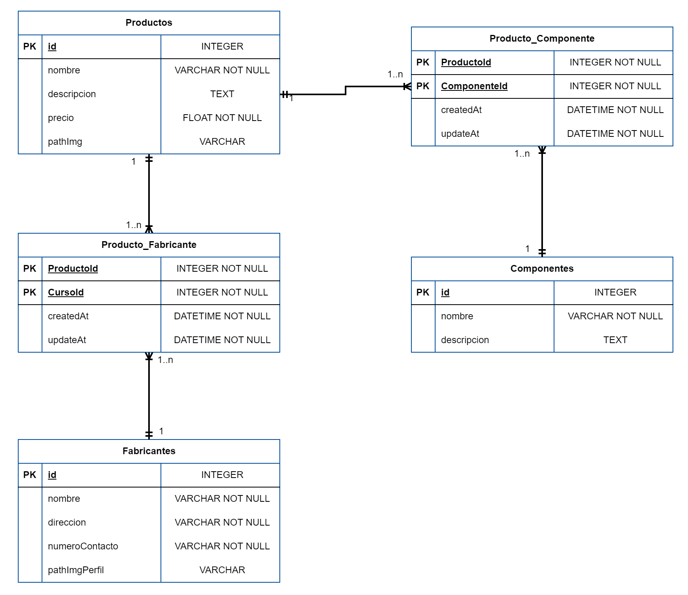

[](https://classroom.github.com/a/NoutYWiV)
# Estrategias de Persistencia - TP 2024

Este trabajo práctico tiene como objetivo principal que los alumnos adquieran experiencia práctica en la implementación de asociaciones 1 a N y N a M en el contexto de una API REST utilizando un ORM (Object-relational mapping).

- Asociaciones 1 a N y N a M:
Las asociaciones 1 a N y N a M son conceptos fundamentales en el diseño de bases de datos relacionales. En una asociación 1 a N, un registro de una tabla está asociado con uno o más registros de otra tabla. Por otro lado, en una asociación N a M, varios registros de una tabla están asociados con varios registros de otra tabla a través de una tabla de unión intermedia.

- API REST:
Una API REST (Representational State Transfer) es un conjunto de reglas y convenciones para la creación de servicios web que permiten la comunicación entre sistemas. En este trabajo práctico, utilizaremos una API REST para exponer recursos y permitir operaciones CRUD (Create, Read, Update, Delete) sobre estos recursos.

- Enfoque Práctico:
Los alumnos implementarán las asociaciones mencionadas anteriormente en el contexto de una API REST utilizando un ORM específico,Sequelize. Se espera que los alumnos comprendan cómo definir modelos, establecer relaciones entre ellos y utilizar las capacidades del ORM para interactuar con la base de datos.

- Criterios de Evaluación:
Se evaluará la precisión y completitud en la implementación de las asociaciones en la API REST, así como la funcionalidad completa del CRUD para los recursos expuestos por la API.

## Descripción del Proyecto

Han sido contratados/as por una empresa de manufactura para desarrollar un sistema interno de gestión de productos. La empresa fabrica una amplia gama de productos tecnológicos que requieren componentes específicos y son producidos por múltiples fabricantes asociados. Actualmente, el proceso de gestión de esta información es manual y está descentralizado, lo que genera demoras y problemas en la producción. La empresa busca automatizar y centralizar estos datos mediante un sistema web eficiente que permita gestionar los productos, fabricantes y componentes de manera integrada.

## Modelo Relacional a implementar

Basandose en el siguiente diagrama de entidad-relacion (DER) deberán generar los modelos y la asociaciones en Sequelize para que la API pueda interacturar con la base de datos a través de los Modelos.



### Descripción del modelo DER
- Un **Producto** puede tener muchos fabricantes, y un **Fabricante** puede fabricar muchos productos.
- Un **Producto** puede tener muchos componentes, y un **Componente** puede formar parte de varios productos.

### Base de datos
El motor de base de datos a utilizar podra ser elegido por los alumnos. La recomendacion es utilizar sqlite para pruebas simple y luego probar con otro motor de base de datos tipo MySql o Postgres.

### Intalacion de dependencias
Debera contar con las dependencias de produccion y desarrollo necesarias de un proyecto node. Por ejemplo:

```npm i sequelize sqlite3```

```npm i -D sequelize-cli``` 

### Tips - Comandos utililes
- Inicializar un proyecto sequelize 

```npx sequelize-cli init```
- Generar un modelos simple


```npx sequelize-cli model:generate --name Carrera --attributes "nombre:string,grado:string,universidad:string"```

## API
Implementar la API utilizando el framework express en el entorde de ejecucion de un poryecto NodeJs. Organizar el código en rutas, controlers y middleware utilizando la separación por recurso. A continuación se detallan los endpoinds que deberán estar disponbiles en la API.


|Verbo|Recurso|Status code|Descripción|
|-----|-------|-----------|-----------|
| GET   | /productos | 200 | Obtener todos los productos |
| GET   | /productos/:id | 200, 404 | Obtener un producto en particular |
| POST  | /productos | 201, 400 | Crear un producto |
| PUT   | /productos/:id | 200, 404 | Modificar los datos de un producto en particular |
| DELETE| /productos/:id | 200, 404, 500 | Borrar un producto en particular |
| POST  | /productos/:id/fabricantes | 201, 404, 400 | Crear la asociación de producto con 1 o N fabricantes |
| GET   | /productos/:id/fabricantes | 200, 404 | Obtener todos los fabricantes de un producto |
| POST  | /productos/:id/componentes | 201, 404, 400 | Crear la asociación de producto con 1 o N componentes |
| GET   | /productos/:id/componentes | 200, 404 | Obtener todos los componentes de un producto |
| GET   | /fabricantes | 200 | Obtener todos los fabricantes |
| GET   | /fabricantes/:id | 200, 404 | Obtener un fabricante en particular |
| POST  | /fabricantes | 201, 400 | Crear un fabricante |
| PUT   | /fabricantes/:id | 200, 404 | Modificar los datos de un fabricante en particular |
| DELETE| /fabricantes/:id | 200, 404, 500 | Borrar un fabricante en particular |
| GET   | /fabricantes/:id/productos | 200, 404 | Obtener todos los productos de un fabricante |
| GET   | /componentes | 200 | Obtener todos los componentes |
| GET   | /componentes/:id | 200, 404 | Obtener un componente en particular |
| POST  | /componentes | 201, 400 | Crear un componente |
| PUT   | /componentes/:id | 200, 404 | Modificar los datos de un componente en particular |
| DELETE| /componentes/:id | 200, 404, 500 | Borrar un componente en particular |
| GET   | /componentes/:id/productos | 200, 404 | Obtener todos los productos de un componente |

## Ejemplos
A modo de ejemplo se muestra el resultado de algunas respuesta de los endpoind detallado en la tabla de la sección anterior.

Recurso:  **_/fabricantes/1/productos_**

Obtiene los datos del fabricante registrado con el id 1, con todos los productos que fabrica, incluyendo los atributos de cada producto y los componentes asociados a esos productos.

```
{
    "id": 1,
    "nombre": "TechCorp",
    "direccion": "1234 Elm St, Ciudad",
    "contacto": "+123456789",
    "pathImgPerfil": "/images/fabricantes/techcorp.jpg",
    "productos": [
        {
            "id": 1,
            "nombre": "Laptop X200",
            "descripcion": "Una laptop de alto rendimiento",
            "precio": 1200.99,
            "pathImg": "/images/productos/laptop-x200.jpg",
            "componentes": [
                {
                    "id": 1,
                    "nombre": "Procesador Intel i7",
                    "descripcion": "Procesador de octava generación"
                },
                {
                    "id": 2,
                    "nombre": "SSD 1TB",
                    "descripcion": "Disco sólido de 1TB de capacidad"
                }
            ]
        },
        {
            "id": 2,
            "nombre": "Smartphone S5",
            "descripcion": "Teléfono inteligente con pantalla OLED",
            "precio": 799.99,
            "pathImg": "/images/productos/smartphone-s5.jpg",
            "componentes": [
                {
                    "id": 3,
                    "nombre": "Pantalla OLED 6.5 pulgadas",
                    "descripcion": "Pantalla de alta definición"
                },
                {
                    "id": 4,
                    "nombre": "Batería 4000mAh",
                    "descripcion": "Batería de larga duración"
                }
            ]
        }
    ]
}
```

Recurso: **_/productos/1/fabricantes_**

Obtiene los datos del producto registrado con el id 1, con todos los fabricantes que lo producen, incluyendo los atributos de cada fabricante.

```
{
    "id": 1,
    "nombre": "Laptop X200",
    "descripcion": "Una laptop de alto rendimiento",
    "precio": 1200.99,
    "pathImg": "/images/productos/laptop-x200.jpg",
    "fabricantes": [
        {
            "id": 1,
            "nombre": "TechCorp",
            "direccion": "1234 Elm St, Ciudad",
            "contacto": "+123456789",
            "pathImgPerfil": "/images/fabricantes/techcorp.jpg"
        },
        {
            "id": 2,
            "nombre": "Innovatech",
            "direccion": "4567 Oak Ave, Ciudad",
            "contacto": "+987654321",
            "pathImgPerfil": "/images/fabricantes/innovatech.jpg"
        }
    ]
}
```

## Consideraciones Finales sobre la Entrega

- El equipo debera entegar un repositorio de github con todas las instrucciones necesarias para correr la api. 
- Deberán  detallar los commandos necesarios para la instalación y ejecución de la api.
- Dentro del Readme.md deberá tener una imagen del diagrama entidad-relacion
- El puerto de listener deberá ser configurable por variable de entorno
- La entega debe soportar cambiar la configuración del motor de base de datos de forma simple en funcion de probar con distintos motores.


